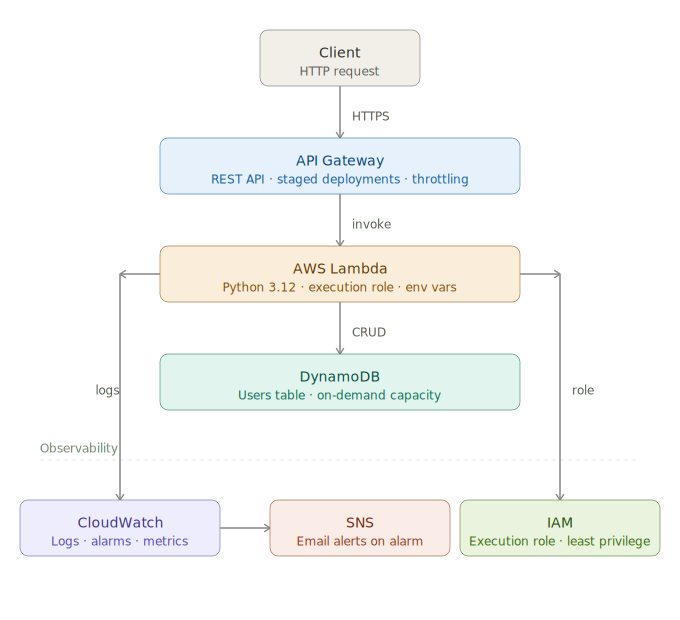

# AWS Serverless User Management API

## What it does
This project is a serverless REST API that provides 
user management functionality.
It allows clients to create, read, update, and delete 
users through HTTP endpoints. Requests are handled by 
AWS Lambda, data is stored in DynamoDB, and execution 
is monitored via CloudWatch.

## Architecture


### AWS Services Used
- API Gateway
- AWS Lambda
- DynamoDB
- CloudWatch
- IAM (execution roles)

## Prerequisites
- AWS CLI installed and configured
- Python 3.x installed
- An AWS account with appropriate IAM permissions

## Deployment
See the [deployment guide](deployment/deployment-guide.md) for step by step instructions, or run the automated script:
```bash
bash deployment/deploy.sh
```

## Author
Tonny Piper | [GitHub](https://github.com/TonnyPiperDev)
